# PENETRATION TESTING REPORT

## FOOTPRINTING & NETWORK SCANNING PHASES

| **Pentester Name** **(Cybersecurity Professional)** | **HAMDA RAZA** |
|---|---|
| **Program/Batch** | **B083-NETWOKRWALKS** |
| **Date** | **14-09-2026** |
| **Modules completed** | W2-PM1 (Multiple Kali Tools) W2-PM5 (Zenmap Scanning) |
| **Client/Target** | 1. Networkwalks (secured written permission already) 2. My own local LAN Network |
| **Permission secured from client?** | Yes |
| **Phases covered** | **Phase 1:** Reconnaissance & Footprinting **Phase 2:** Scanning & Network Discovery **Phase 3-5:** In Progress |

---

# 1. Liability Disclaimer

I have performed these activities only on the systems and devices where I had secured appropriate written permission or on devices and systems that I own myself. All these materials are for educational and research purposes only.

Do not use anything from this repository to access, scan, enumerate, or attack systems without proper authorization. The instructor, authors, and Networkwalks are not responsible for misuse of the information contained in this repository. Every action taken is the responsibility of the individual performing it.

Unauthorized access, scanning, or security testing may result in legal consequences. Security testing should always be performed within an authorized scope.

---

# 2. Introduction

This report covers the footprinting of the **netwokrwalks.com** using multiple Kali Linux tools (W2-PM1) and scanning of my own local network using **Zenmap** (W2-PM5).

The footprinting phase focuses on gathering publicly available information about the authorized target, while the scanning phase focuses on identifying active hosts and available network information within my authorized/local network.

Together, these activities demonstrate how a cybersecurity professional can move from information gathering and reconnaissance to network discovery.

All commands used during the footprinting phase were executed in **Kali Linux**, while the network scanning activity was performed on a **Windows PC using Zenmap**.

Every activity documented in this report includes the command used, the observed result, an explanation of the finding, and screenshot evidence.

---

# 3. Objectives

The main objectives of this practical were:

- To understand the reconnaissance and footprinting phase.
- To collect publicly available information about an authorized target.
- To identify domain registration and DNS information.
- To fingerprint web technologies.
- To inspect HTTP response headers.
- To identify Web Application Firewall information.
- To enumerate DNS records.
- To identify the local IP address and subnet.
- To discover live hosts on the authorized/local network.
- To identify IP and MAC address information where available.
- To generate and analyze network topology using Zenmap.
- To document the results in a professional penetration testing report.

---

# 4. Tools Used

The table below lists each tool used in this report and its purpose.

| **Tool** | **Purpose** |
|---|---|
| **Kali Linux & Windows** | Operating systems used for reconnaissance and network scanning activities |
| **WHOIS** | Find domain registration details, ownership information, dates and name servers |
| **WhatWeb** | Fingerprint web technologies, server, CMS, plugins and other exposed information |
| **Nslookup** | Resolve the domain name to its IP address using DNS |
| **Curl -I** | Read and inspect HTTP response headers of the website |
| **Wafw00f** | Detect whether a Web Application Firewall protects the site |
| **DNSRecon** | Enumerate DNS records such as NS, MX, SPF, TXT and SRV records |
| **Zenmap (Nmap GUI)** | Scan the local subnet to find live hosts, IP addresses and MAC addresses |
| **Windows CMD** | Identify local IP address, network configuration and MAC address information |

---

# 5. Activities Performed

## 5.1 Footprinting & Reconnaissance

I performed reconnaissance against the **networkwalks.com** using six Kali Linux tools: **WHOIS, WhatWeb, Nslookup, Curl, Wafw00f and DNSRecon**. Each tool was used to collect a different type of information about the target.

The following subsections document the commands used, results observed, security relevance, and evidence collected during the footprinting phase.

---

## 5.1.1 WHOIS

### Objective

WHOIS was used to obtain publicly available domain registration information and identify domain-related information such as registration details and name servers.

### Command Used

    whois [TARGET-DOMAIN]

### Observation

The WHOIS query provided publicly available registration and domain infrastructure information associated with the target.

### Security Relevance

Publicly available domain registration and infrastructure information can assist a security professional in understanding the external footprint of a target.

### Evidence

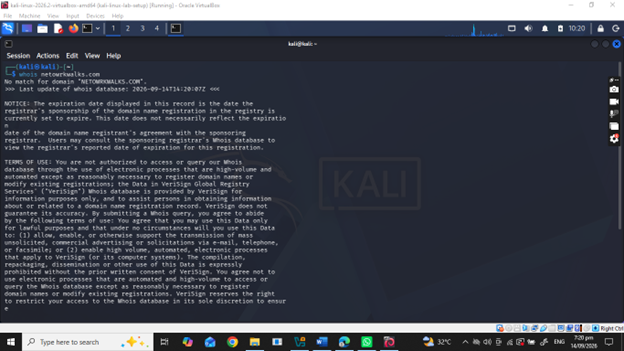

---

## 5.1.2 WhatWeb

### Objective

WhatWeb was used to identify technologies and components used by the target website.

### Command Used

    whatweb [TARGET-DOMAIN]

### Observation

WhatWeb identified the technologies and web application components exposed by the target website.

### Security Relevance

Technology and version information may help security professionals identify software components that require further security review.

### Evidence

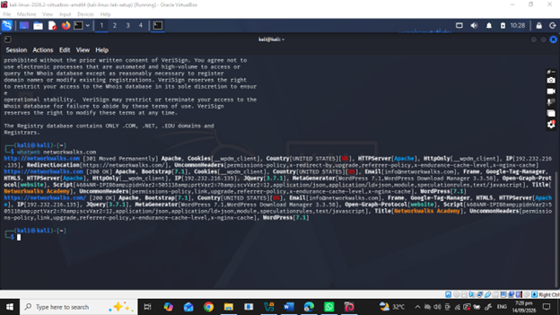

---

## 5.1.3 Nslookup

### Objective

Nslookup was used to resolve the target domain name and identify its associated IP address.

### Command Used

    nslookup [TARGET-DOMAIN]

### Observation

The DNS query successfully resolved the target domain to the IP address shown above.

### Security Relevance

Identifying the IP address provides information about the network location of the publicly accessible service.

### Evidence

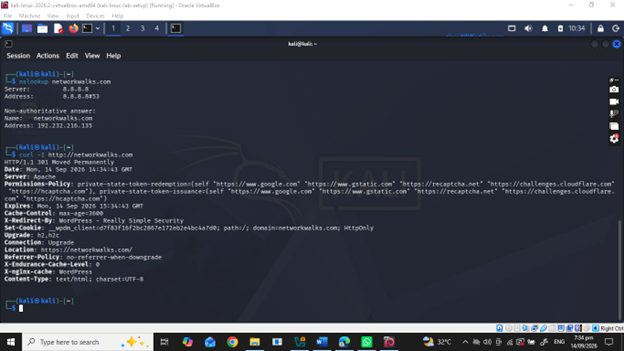

---

## 5.1.4 Curl

### Objective

Curl was used with the `-I` option to inspect the HTTP response headers returned by the target website.

### Command Used

    curl -I https://[TARGET-DOMAIN]

### Observation

The HTTP response headers provided additional technical information about the web application.

### Security Relevance

HTTP response headers may expose technical information that can assist technology fingerprinting and further authorized enumeration.

### Evidence

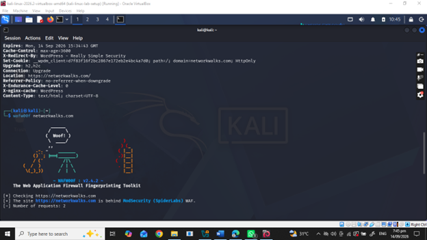

---

## 5.1.5 Wafw00f

### Objective

Wafw00f was used to determine whether a Web Application Firewall (WAF) was protecting the target website.

### Command Used

    wafw00f https://[TARGET-DOMAIN]

### Observation

The Wafw00f result indicated whether a Web Application Firewall was detected protecting the target website.

### Security Relevance

Identifying a WAF provides information about the security architecture and defensive controls associated with the web application.

### Evidence

---

## 5.1.6 DNSRecon

### Objective

DNSRecon was used to enumerate DNS-related information associated with the target domain.

### Command Used

    dnsrecon -d [TARGET-DOMAIN]

### Observation

The DNS enumeration provided information relating to DNS records and infrastructure associated with the target domain.

### Security Relevance

DNS information can help a security professional understand the external infrastructure associated with a domain.

### Evidence

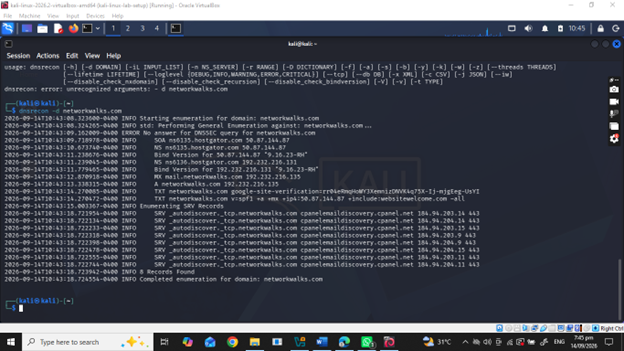

---

# 5.2 Network Scanning with Zenmap

For the second activity, I used **Zenmap** to perform network discovery on my own local network.

The practical required me to identify my local IP address and subnet, discover live hosts, identify their IP and MAC addresses where available, and generate a network topology.

I first used the Windows `ipconfig` command to identify my local IP address and LAN subnet. I then entered the subnet into Zenmap and selected the **Ping Scan** profile to identify active hosts.

---

## 5.2.1 Identifying Local Network Configuration

### Command Used

    ipconfig

### Local Network Information

| **Information** | **Result** |
|---|---|
| **Local IP Address** | 192.168.56.1 |
| **Subnet Mask** | 255.255.255.0 |
| **Default Gateway** | not available |
| **Network/Subnet** | not available |

### Observation

The `ipconfig` command was used to identify the network interfaces and determine the local IP address, subnet mask, and network range used for the Zenmap scan.

### Evidence

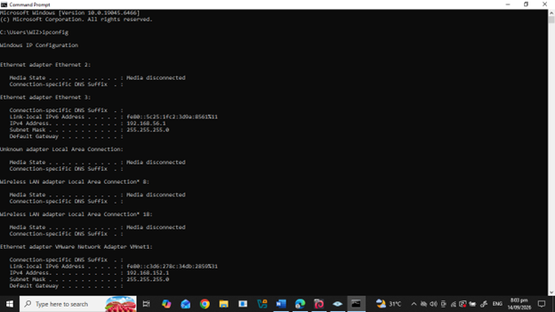

---

## 5.2.2 Zenmap Ping Scan

### Objective

Zenmap was used with the **Ping Scan** profile to discover active hosts on the authorized/local network.

### Target/Subnet

    192.168.56.1/24

### Nmap Command

    nmap -sn 192.168.56.1/24'

### Scan Result

**Total IP addresses scanned:** 1

**Live hosts discovered:** 1

### Live Hosts Identified

| **#** | **IP Address** | **MAC Address** | **Status** |
|---|---|---|---|
| 1 | 192.168.56.1 | NOT AVAILABLE | Up |

### Observation

The Zenmap Ping Scan identified the hosts that responded during network discovery.

### Security Relevance

Network discovery helps a security professional understand which devices are active on an authorized network and can help identify unexpected or unknown devices.

### Evidence

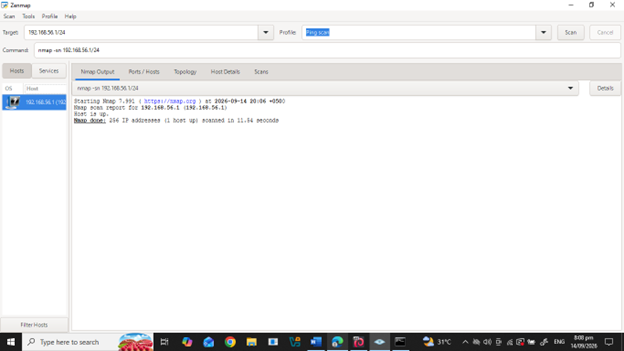

---

## 5.2.3 Zenmap Topology

After completing the network scan, I opened the **Topology** section in Zenmap to visualize the discovered hosts and network relationships.

The topology view provided a graphical representation of the hosts discovered during the network scanning activity.

### Observation

The topology illustrates the relationship between the scanning system and the hosts identified during the authorized network discovery process.

### Evidence

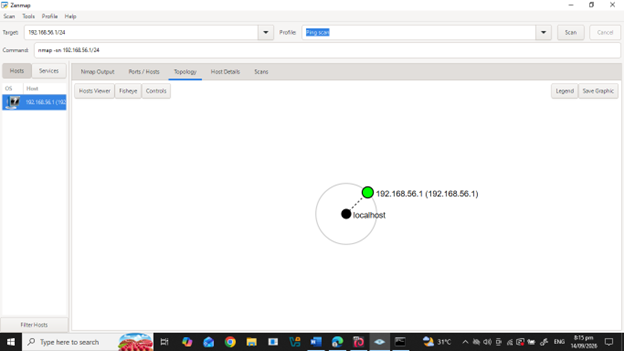

---

# 6. Network Scanning Summary

| **Item** | **Result** |
|---|---|
| **Network/Subnet Scanned** | 192.168.56.1/24 |
| **Scan Type** | Ping Scan |
| **Nmap Command** | `nmap -sn 192.168.56.1/24 |
| **Total IP Addresses Scanned** |     1    |
| **Live Hosts Found** |     1    |
| **MAC Addresses Identified** | not available |
| **Topology Generated** | Yes |

### Current Scan Result

Based on the actual Zenmap scan performed during this practical:

- **Network/Subnet:** `192.168.56.1/24`
- **Scan Type:** Ping Scan
- **Nmap Command:** `nmap -sn 192.168.56.1/24`
- **Total IP addresses scanned:** 256
- **Live hosts found:** 1
- **Live host identified:** `192.168.56.1`

# 7. Findings Summary

The following table summarizes the observations made during the footprinting and network scanning activities.

| **#** | **Risk / Finding** | **Evidence / Observation** | **Potential Impact** | **Risk Level** |
|---|---|---|---|---|
| 1 | Domain information exposed | WHOIS returned publicly available domain information | May assist external reconnaissance | Low |
| 2 | Web technology information exposed | WhatWeb identified web technologies | May assist technology fingerprinting | Medium |
| 3 | Server IP address identifiable | Nslookup resolved the domain to an IP address | Provides information about the network location of the web service | Low |
| 4 | HTTP technical information exposed | Curl returned HTTP response headers | May assist technology fingerprinting and further enumeration | Low |
| 5 | WAF technology identifiable | Wafw00f identified **ModSecurity (SpiderLabs) WAF** | Reveals information about the web application's security architecture | Low |
| 6 | DNS infrastructure information exposed | DNSRecon identified DNS-related records | DNS information can help build an external infrastructure profile | Medium |
| 7 | Live host visible on local network | Zenmap identified a live host | Unexpected or unauthorized devices may require investigation | Medium |

# 8. Risk Analysis / Impact

Based on the information collected during the footprinting and network scanning activities, the observations documented in this report represent potential security considerations.

The findings identified during these exercises are primarily related to information exposure and network visibility.

These observations should not automatically be considered confirmed vulnerabilities.

For example, the identification of a software technology, IP address, DNS record, WAF, or live host does not by itself prove that the system is vulnerable.

Further authorized security testing would be required to validate any actual vulnerability.

## Risk Level Key

| **Risk Level** | **Meaning** |
|---|---|
| **Critical** | Immediate and significant security concern |
| **High** | Significant security concern requiring prompt attention |
| **Medium** | Security concern requiring review and appropriate mitigation |
| **Low** | Limited security impact or informational finding |

# 9. Recommendations

Based on the observations from the footprinting and network scanning activities, the following security improvements are recommended.

## 9.1 Review Publicly Exposed Technology Information

Organizations should regularly review what information about their web technologies, CMS platforms, plugins, and application components is publicly visible.

## 9.2 Keep Software Updated

CMS platforms, plugins, operating systems, and other web technologies should be regularly updated and reviewed against current security advisories.

## 9.3 Review HTTP Headers

HTTP response headers should be reviewed to determine whether unnecessary technical information is being exposed.

## 9.4 Review DNS Records Regularly

DNS records should be checked periodically to ensure that only required information and services are publicly exposed.

## 9.5 Properly Configure and Monitor Security Controls

Security controls such as Web Application Firewalls should be properly configured, maintained, and monitored where applicable.

## 9.6 Perform Regular Internal Network Discovery

Organizations should periodically scan their own authorized networks to identify active devices and maintain visibility of the network environment.

## 9.7 Investigate Unknown Devices

Any unexpected device discovered during network scanning should be investigated and verified.

## 9.8 Maintain Network Documentation

Network topology and device information should be documented and updated regularly.

## 9.9 Perform Security Testing with Authorization

Reconnaissance, scanning, enumeration, and other security testing activities should only be performed against systems and networks where appropriate authorization has been provided.

# 10. Conclusion

During this Week 2 cybersecurity practical, I completed activities covering **footprinting, reconnaissance, and network scanning**.

In the footprinting activity, I used multiple Kali Linux tools to collect information about the authorized target. WHOIS was used to obtain domain-related information, WhatWeb was used to identify web technologies, Nslookup was used to resolve the domain to an IP address, Curl was used to inspect HTTP response headers, Wafw00f was used to identify WAF information, and DNSRecon was used to collect DNS-related information.

In the network scanning activity, I used Windows network commands and **Zenmap** to identify my local network configuration and discover active hosts. I also reviewed IP and MAC address information where available and generated a network topology.

The exercises demonstrated that information gathering and network discovery are important stages of cybersecurity assessment. Even before attempting any exploitation, a security professional can learn significant information about an environment by analyzing publicly available information and network responses.

I also learned the importance of documenting technical findings clearly. A professional cybersecurity report should explain what was performed, what was discovered, what the observation means, what potential risk it may create, and what can be done to reduce that risk.

Finally, I learned that reconnaissance and scanning must always be performed within an authorized scope. The activities documented in this repository were performed as part of an authorized educational cybersecurity practical and/or on my own local network.

---

# 11. Evidence Collected

The following screenshots are included as evidence of the activities performed during this practical.

## Footprinting Evidence

### WHOIS

### WhatWeb

### Nslookup

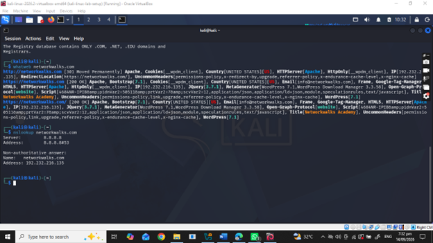

### Curl

### Wafw00f

### DNSRecon

---

## Network Scanning Evidence

### Windows IP Configuration

### Zenmap Ping Scan

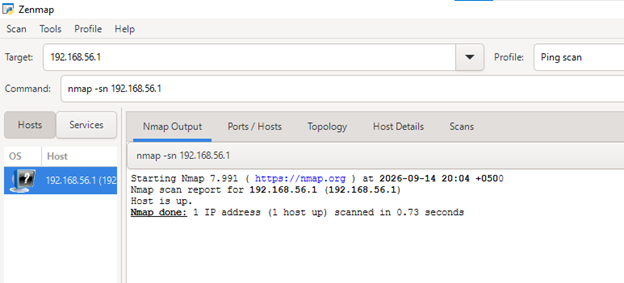

### Zenmap Topology

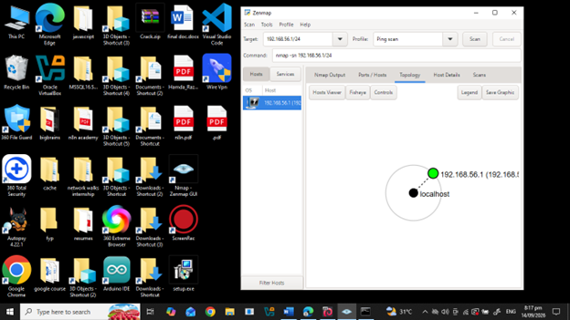

---

**👤 Author**

**Hamda Raza**  
Cybersecurity Professional **B083**  
LinkedIn: [Hamda Rashid](https://www.linkedin.com/in/hamda-rashid-67a157356/)

# 📌 Project Information

**Program Name:** Cybersecurity Program at Networkwalks  
**Week:** 02  
**Modules:** W2-PM1 (Multiple Kali Tools) | W2-PM5 (Zenmap Scanning)  
**Repository:** [GitHub](https://github.com/hamda123113/NETWORKWALKS-B083-WK3-PM2-PM5-CYBERSECURITY-PEN-TESTING-REPORT)

---

